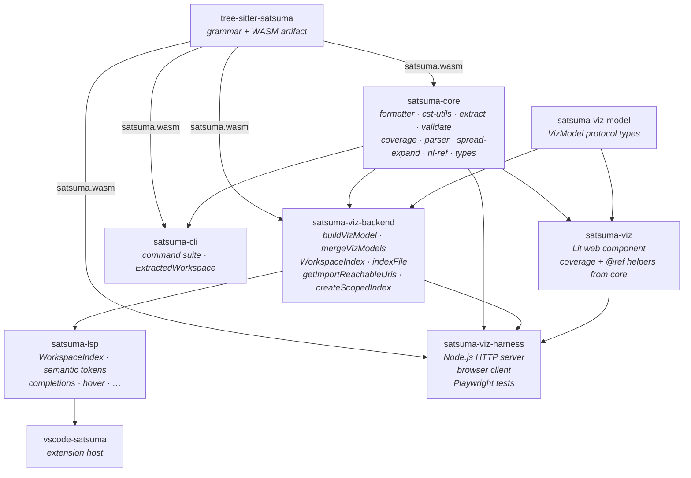
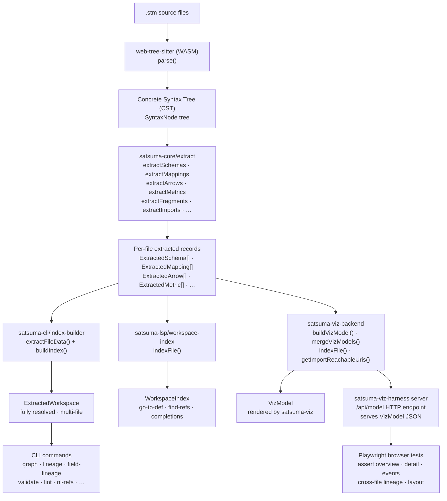
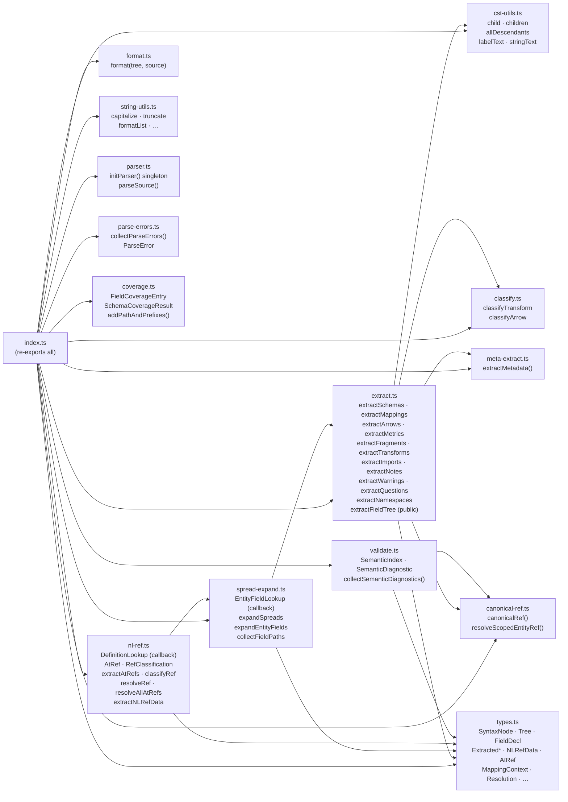
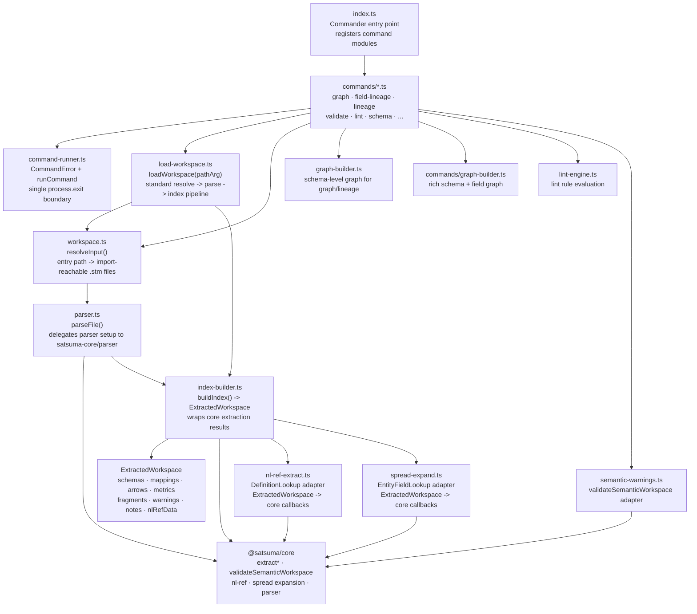
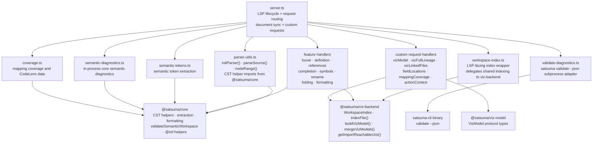
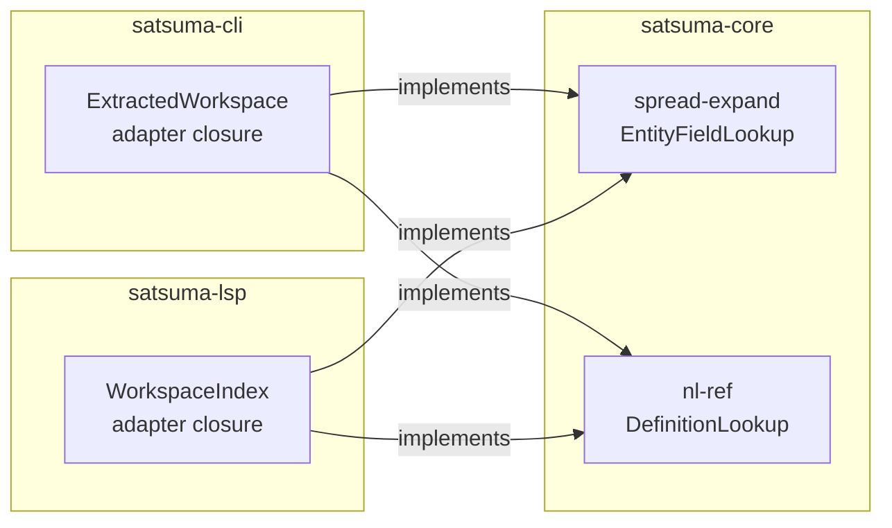

# Satsuma Tooling Architecture

> Last updated: 2026-04-07 — corrected the `satsuma-viz` → `satsuma-core` dependency and replaced ASCII structure diagrams with Mermaid.

See `adrs/` for the architectural decision records that explain the choices made here.

---

## Package Map

The `tooling/` directory contains nine npm packages:

| Package | Role |
|---------|------|
| `tree-sitter-satsuma` | Grammar definition and compiled parser artifacts (WASM) |
| `satsuma-core` | Shared extraction, formatting, validation, and analysis library — the foundation |
| `satsuma-viz-model` | Shared VizModel protocol contract — types for the server→viz JSON payload |
| `satsuma-viz-backend` | Shared VizModel assembly — `buildVizModel`, `mergeVizModels`, workspace index; used by LSP server and viz harness |
| `satsuma-cli` | CLI command suite; consumer of satsuma-core |
| `satsuma-lsp` | Editor-agnostic LSP server; consumer of satsuma-core, satsuma-viz-model, satsuma-viz-backend |
| `satsuma-viz` | Lit web component that renders VizModel as an interactive diagram; consumes satsuma-viz-model and small shared helpers from satsuma-core |
| `vscode-satsuma` | VS Code extension shell; consumer of satsuma-lsp and satsuma-viz |
| `satsuma-viz-harness` | Standalone HTTP harness for fixture-driven browser testing of satsuma-viz; Playwright tests |

### Package Dependency Diagram



`satsuma-core` and `satsuma-viz-model` have no upward dependencies on consumer packages such as the CLI, LSP, VS Code extension, or viz harness. `satsuma-viz-backend` is the shared boundary between the LSP server and the viz harness — it owns all VizModel assembly logic so neither consumer duplicates it.

---

## Data Flow



---

## satsuma-core Module Structure



### Key Types

| Type | Module | Description |
|---|---|---|
| `SyntaxNode` | `types.ts` | Abstract CST node interface (structurally matches web-tree-sitter `Node`) |
| `Tree` | `types.ts` | Parsed tree with `rootNode: SyntaxNode` |
| `FieldDecl` | `types.ts` | Recursive field: `{ name, type, isList?, children?, spreads?, metadata? }` |
| `ExtractedSchema` | `types.ts` | Schema block: name, namespace, fields, spreads, metadata |
| `ExtractedMapping` | `types.ts` | Mapping block: sourceRefs, targetRef, arrows |
| `ExtractedArrow` | `types.ts` | Arrow: sourceFields, targetField, transform steps, classification |
| `MetaEntry` | `types.ts` | Metadata entry union: tag, kv, enum, note, slice |
| `AtRef` | `types.ts` | `{ ref: string, offset: number }` — a single @-ref extracted from NL text |
| `NLRefData` | `types.ts` | All NL strings + @-refs for a file |
| `Resolution` | `types.ts` | `{ resolved: boolean, resolvedTo: { kind, name } \| null }` |
| `EntityFieldLookup` | `spread-expand.ts` | Callback for spread resolution: `(name, ns) => { fields } \| null` |
| `DefinitionLookup` | `nl-ref.ts` | Callback for @-ref resolution: `(name, ns) => { kind, fields? } \| null` |
| `SemanticIndex` | `validate.ts` | Minimal structural interface accepted by `collectSemanticDiagnostics`; satisfied by CLI `ExtractedWorkspace` |
| `SemanticDiagnostic` | `validate.ts` | `{ file, line, column, severity, rule, message }` — one semantic warning or error |
| `FieldCoverageEntry` | `coverage.ts` | `{ path, mapped: boolean }` — coverage status for one field path |
| `SchemaCoverageResult` | `coverage.ts` | Per-schema list of `FieldCoverageEntry` records |
| `ParseError` | `parse-errors.ts` | `{ file, line, column, message }` — structural error from tree-sitter ERROR/MISSING nodes |

---

## satsuma-cli Internal Structure



`ExtractedWorkspace` (CLI-specific; renamed from `WorkspaceIndex` in sl-erxz to avoid colliding with viz-backend's editor-shaped `WorkspaceIndex`) holds fully resolved, multi-file semantic data:
- `schemas: Map<string, SchemaRecord>`
- `mappings: Map<string, MappingRecord>`
- `arrows: ArrowRecord[]`
- `metrics: Map<string, MetricRecord>`
- `fragments: Map<string, FragmentRecord>`
- `nlRefData: NLRefData[]` ← type from satsuma-core
- plus warnings, questions, notes, namespace metadata

---

## satsuma-lsp Internal Structure



`VizModel` assembly has been extracted to `@satsuma/viz-backend` (`buildVizModel`,
`mergeVizModels`, `getImportReachableUris`, `createScopedIndex`) so that the viz
harness can build VizModels without depending on the LSP server. The LSP server
imports from `@satsuma/viz-backend` rather than owning this logic directly.

`WorkspaceIndex` is the IDE-oriented index:
- `Map<string, DefinitionEntry[]>` — keyed by qualified name
- `DefinitionEntry` has `{ uri, range, kind, namespace, fields? }` for schema/fragment entries

---

## Nested Field Handling

Satsuma schemas support arbitrarily nested record and list-of-record fields:

```satsuma
schema orders {
  order_id string
  customer record {
    id string
    name string
  }
  line_items list_of record {
    product_id string
    quantity int
  }
}
```

**Rule:** Any code that works with fields must recurse through `FieldDecl.children`. Use `satsuma-core`'s public `extractFieldTree()` to get the full recursive tree. Use `collectFieldPaths()` from `spread-expand.ts` to flatten to dotted paths (e.g. `line_items.product_id`).

The `fieldLocations` LSP handler was historically flat (only top-level fields). This was fixed in Feature 26 (ticket sl-ysy4) by routing through `extractFieldTree()`.

---

## Callback Abstractions

Two callback interfaces decouple satsuma-core from consumer index types:



See ADR-005 (EntityFieldLookup) and ADR-006 (DefinitionLookup) for design rationale.

---

## Extension Points

To add a new extraction consumer (e.g. a second language server, a linter, a code generator):

1. Add a dependency on `@satsuma/core`
2. Call `extractSchemas()`, `extractMappings()`, etc. on the tree root node
3. For spread-aware field lists, implement `EntityFieldLookup` and call `expandSpreads()`
4. For NL @-ref extraction, call `extractAtRefs()` on NL string text
5. For resolved @-ref data, implement `DefinitionLookup` and call `resolveRef()`

No CLI or LSP code needs to be imported.

---

## Test Strategy

| Package | Test location | Approach |
|---|---|---|
| `tree-sitter-satsuma` | `test/corpus/` | tree-sitter corpus tests (parse → CST shape assertions) |
| `satsuma-core` | `test/*.test.js` | Unit tests against pure functions; no I/O, no WASM required |
| `satsuma-cli` | `test/*.test.ts` | Integration tests via CLI commands and focused command helpers |
| `satsuma-lsp` | `test/*.test.js` | Unit tests for LSP handlers, diagnostics, custom requests, and extraction adapters |
| `satsuma-viz-backend` | `test/*.test.js` | Unit tests for VizModel builders and shared workspace-index behaviour |
| `satsuma-viz-harness` | `tests/*.spec.ts` | Playwright browser tests for the rendered viz component |

Browser-level viz harness tests use the sentinel watcher workflow documented in `AGENTS.md`; agents should not run Playwright directly in the sandbox.

---

## See Also

- `adrs/` — Architectural decision records
- `SATSUMA-V2-SPEC.md` — Language specification (authoritative)
- `SATSUMA-CLI.md` — CLI command reference
- `archive/features/29-codebase-and-test-cleanup/PRD.md` — completed Feature 29 cleanup plan
