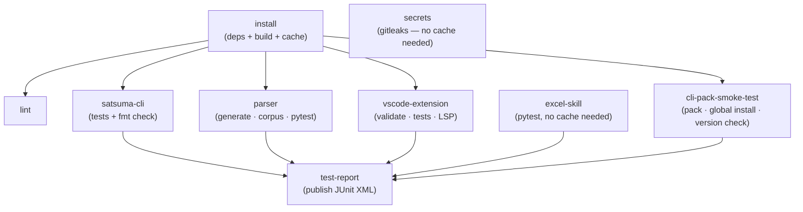
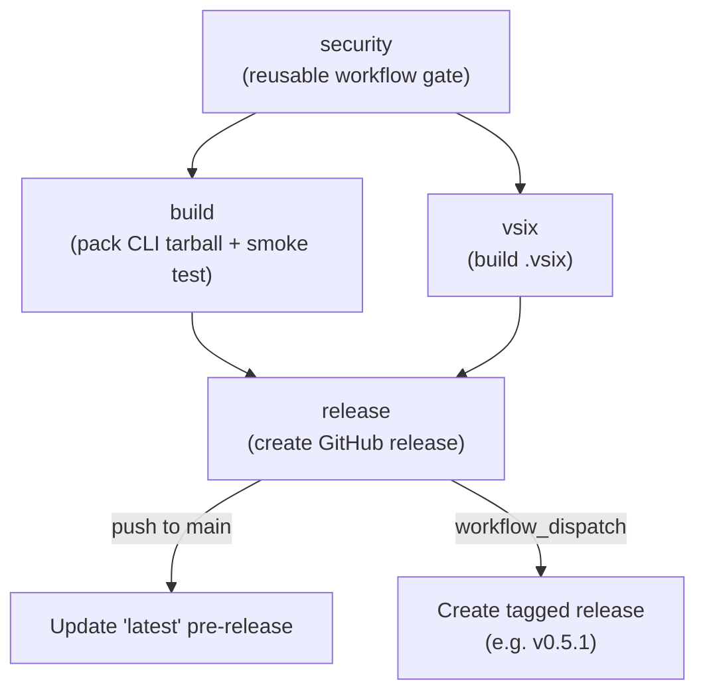
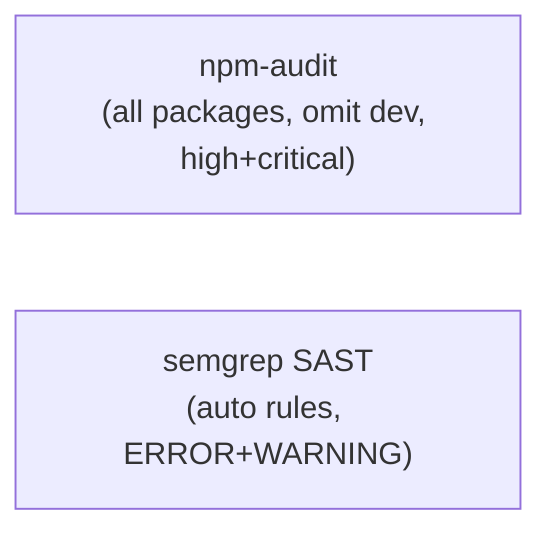
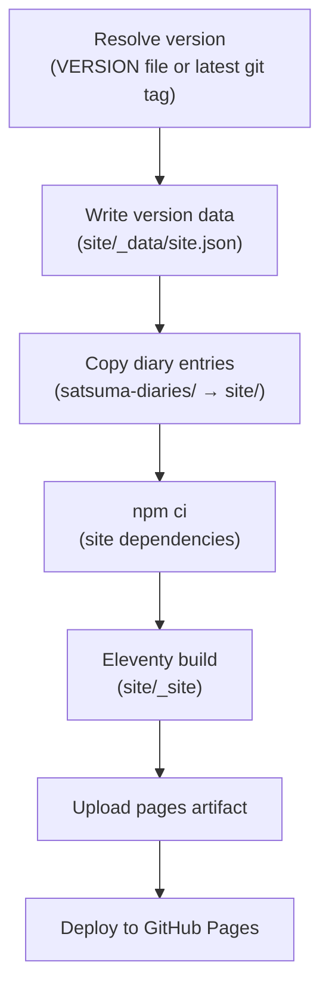
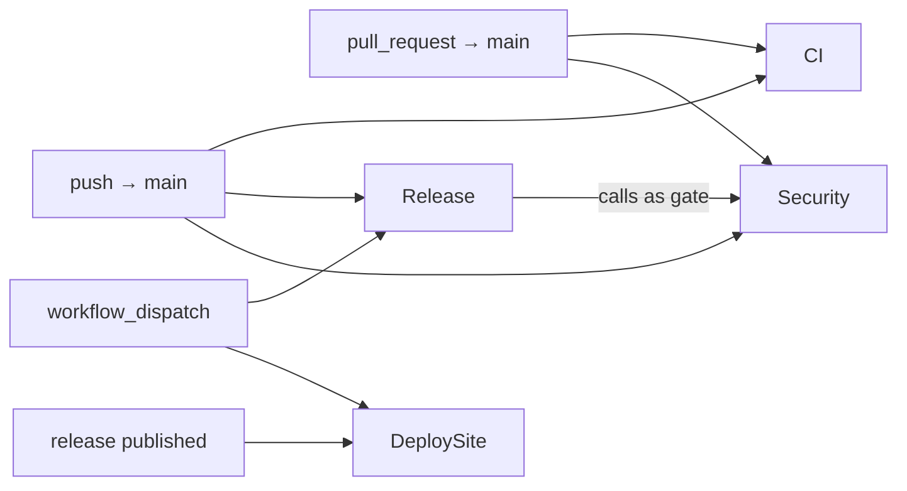

# CI Workflows

This document describes every GitHub Actions workflow in this repository, when
each runs, what it does, and how the jobs within each workflow depend on each
other.

## Overview

Four workflows cover the full delivery pipeline:

| Workflow | File | Triggers |
|---|---|---|
| [CI](#ci-workflow) | `ci.yml` | Push / PR → `main` |
| [Release](#release-workflow) | `release.yml` | Push → `main` · `workflow_dispatch` |
| [Security](#security-workflow) | `security.yml` | Push / PR → `main` · called by Release |
| [Deploy Site](#deploy-site-workflow) | `deploy-site.yml` | GitHub release published · `workflow_dispatch` |

CI and Release both fire on every push to `main`. CI validates the code;
Release builds and publishes the distributable artifacts (CLI tarball and VS
Code `.vsix`). The Security workflow is also invoked directly by Release as a
gate — it is not merely a CI concern.

---

## CI Workflow

**File:** `.github/workflows/ci.yml`
**Triggers:** push to `main`, pull requests targeting `main`

The CI workflow verifies that the whole repository is correct: all tests pass,
generated files are up to date, the CLI tarball installs cleanly, and no
secrets are present. It uses a shared workspace cache so each test job avoids
reinstalling dependencies.

### Job graph



### Jobs

#### `install`

Installs all workspace dependencies, builds `satsuma-core`, compiles the WASM
parser, runs the CLI `prebuild` (copies generated sources and WASM into
`dist`), and builds the `satsuma-viz` bundle. Saves the full workspace —
`node_modules`, `dist`, generated sources, and WASM artifacts — as a cache
keyed on `github.sha`. All downstream jobs restore this cache rather than
reinstalling.

#### `lint`

Restores the workspace cache and runs the full lint suite:

- **ESLint** over all TypeScript and JavaScript sources
- **markdownlint-cli2** over all Markdown files
- **yamllint** over `.github/workflows/`
- **ruff** over Python scripts and skill code

Python lint tools (`yamllint`, `ruff`) are installed directly; they are not in
the workspace cache.

#### `satsuma-cli`

Runs the full CLI test suite (~600+ tests) and verifies that all files in
`examples/` are formatter-clean (`satsuma fmt --check`). Test results are
uploaded as a JUnit XML artifact for the test report.

#### `parser`

Runs four distinct checks:

1. **`npm run generate`** — regenerates the parser from `grammar.js`
2. **Generated-sources check** — fails if `src/` differs from the committed
   state (catches uncommitted grammar changes)
3. **Conflict count check** — compares the grammar's conflict count against
   `CONFLICTS.expected`; fails if they diverge
4. **Corpus tests** — `tree-sitter test` over all 480+ fixture tests
5. **pytest suite** — fixture tests, CST consumer tests, and smoke tests over
   the full example corpus

Test results are uploaded as JUnit XML.

#### `vscode-extension`

Validates the extension manifest and TextMate grammar, runs the TextMate
fixture and golden tests, builds the full client/server/webview bundle, and
runs the LSP server test suite. The LSP tests require the WASM parser to be
present, so the step rebuilds it from cache before running.

Test results are uploaded as JUnit XML.

#### `cli-pack-smoke-test`

Verifies that the CLI tarball can be installed end-to-end. It runs `npm run
pack` (which replaces the `@satsuma/core` `file:` symlink with a real copy
before packing — see [below](#packaging-why-the-symlink-must-be-replaced)), installs
the resulting `satsuma-cli.tgz` globally, and checks that `satsuma --version`
succeeds. This job prevents tarball regressions from reaching the release
workflow.

#### `excel-skill`

Runs the Python tests for the `excel-to-satsuma` Agent Skill. This job does
not need the workspace cache — it installs only `pytest` and `openpyxl`
directly.

#### `test-report`

Aggregates JUnit XML artifacts from the four test jobs and publishes a
consolidated check using `dorny/test-reporter`. Runs even if upstream jobs
fail (`if: always()`).

#### `secrets`

Runs `gitleaks` over the full commit history (full checkout via
`fetch-depth: 0`) to detect any committed secrets. Independent of the build
cache.

---

## Release Workflow

**File:** `.github/workflows/release.yml`
**Triggers:**
- Push to `main` → updates the rolling `latest` pre-release
- `workflow_dispatch` with a `version` input (e.g. `v0.5.1`) → creates a
  tagged release with changelog-extracted release notes

### Job graph



### Jobs

#### `security` (reusable)

Calls `.github/workflows/security.yml` as a required gate before any build
work begins. Both the CLI tarball and the `.vsix` are only built if security
passes.

#### `build`

Installs all workspace dependencies, builds the WASM parser, and runs `npm
run pack` to produce `satsuma-cli.tgz`. The `pack` script (in
`tooling/satsuma-cli/scripts/pack.js`) is the single source of truth for
tarball creation — it is the same script used locally and in CI. After
packing, the step installs the tarball globally and runs `satsuma --version`
as a final smoke test before the artifact is uploaded.

The tarball artifact is uploaded for consumption by the `release` job.

#### `vsix`

Installs all workspace dependencies, builds the WASM parser, builds the
`satsuma-viz` bundle (needed by the webview), builds the full extension
bundle (client + server + webview), and packages it as `vscode-satsuma.vsix`
using `@vscode/vsce`. The `.vsix` artifact is uploaded for consumption by
the `release` job.

#### `release`

Downloads both artifacts and creates a GitHub release:

- **On `workflow_dispatch`:** extracts release notes for the given version tag
  from `CHANGELOG.md` (the section starting `## vX.Y.Z —`), then creates a
  tagged release with those notes and attaches both artifacts.
- **On push to `main`:** deletes any existing `latest` pre-release (including
  its tag), then recreates it as a `--prerelease` with install instructions,
  attaching both artifacts.

### Release artifacts

Both release types attach:

| Artifact | Install method |
|---|---|
| `satsuma-cli.tgz` | `npm install -g <url>` |
| `vscode-satsuma.vsix` | `code --install-extension vscode-satsuma.vsix` |

### Creating a tagged release

1. Add a `## vX.Y.Z — <date>` section to `CHANGELOG.md` with release notes.
2. Trigger **Actions → Release → Run workflow** with the version tag (e.g.
   `v0.5.1`).

The workflow will fail if no matching changelog section is found or if it is
empty, so the release notes are always non-trivial.

---

## Security Workflow

**File:** `.github/workflows/security.yml`
**Triggers:** push to `main`, pull requests targeting `main`, `workflow_call`
(called by Release)

The Security workflow runs two independent checks. It is designed to be both a
standalone CI job and a reusable gate callable from Release.

### Job graph



These jobs are independent and run in parallel.

### Jobs

#### `npm-audit`

Installs all workspace dependencies and runs `npm audit --omit=dev
--audit-level=high` across every package (`satsuma-cli`, `tree-sitter-satsuma`,
`vscode-satsuma`, `vscode-satsuma/server`). Known findings can be acknowledged
in `.security-allowlist.yml` — the `scripts/parse-security-allowlist.py` script
extracts the allowlist before the audit runs.

#### `semgrep`

Runs Semgrep SAST in a container using the `auto` ruleset at `ERROR` and
`WARNING` severity. Produces a SARIF file that is uploaded to GitHub's code
scanning dashboard (requires GitHub Advanced Security). Allowlisted rule IDs
are excluded via `--exclude-rule` flags.

---

## Deploy Site Workflow

**File:** `.github/workflows/deploy-site.yml`
**Triggers:**
- A GitHub release is **published** (includes both tagged and latest releases)
- `workflow_dispatch` (manual trigger)

### Job graph



### Notes

- The site is deployed to GitHub Pages under the `github-pages` environment.
- Version is resolved from a `VERSION` file at the repo root if present;
  otherwise falls back to the most recent `v*` git tag.
- The `pages` concurrency group prevents overlapping deployments; in-progress
  deploys are not cancelled if a new one is queued.
- The deploy-site workflow fires on **every** published release, including the
  rolling `latest` pre-release that the Release workflow creates on each push
  to `main`.

---

## Workflow Trigger Summary



---

## Packaging: Why the Symlink Must Be Replaced

`@satsuma/core` is declared as a `file:../satsuma-core` dependency. npm
installs this as a symlink inside `node_modules/@satsuma/core` pointing to the
sibling package directory. When `npm pack` bundles the dependencies
(required for a self-contained distributable), it follows the symlink and
produces tarball entries such as:

```
package/../satsuma-core/node_modules/web-tree-sitter/...
```

npm rejects these paths on install with `TAR_ENTRY_ERROR path contains '..'`.

The fix, implemented in `tooling/satsuma-cli/scripts/pack.js`, is to replace
the symlink with a real directory copy before calling `npm pack`. This gives
the packer a self-contained directory tree with no `..` references. The same
script is used locally (`npm run pack`) and in every CI environment, so local
and CI produce identical tarballs.

`scripts/verify-pack.js` enforces this at pack time: if any tarball entry
contains `..`, it throws with a clear error before the artifact is uploaded.
