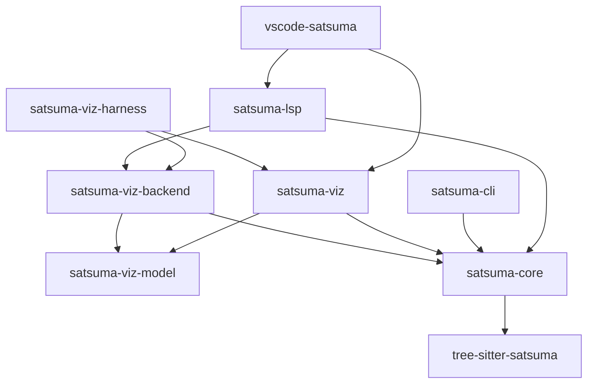
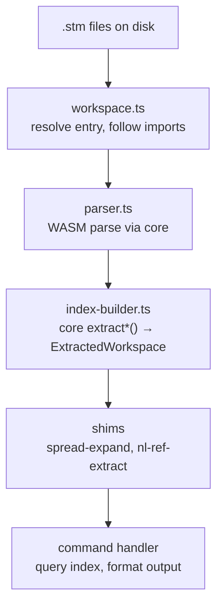
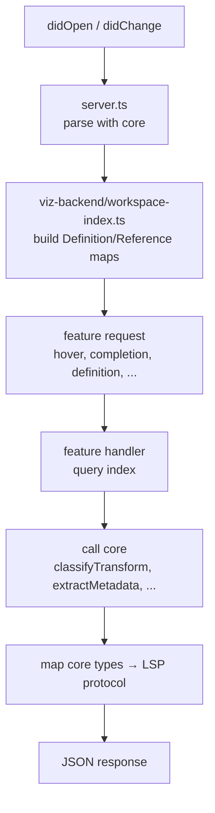
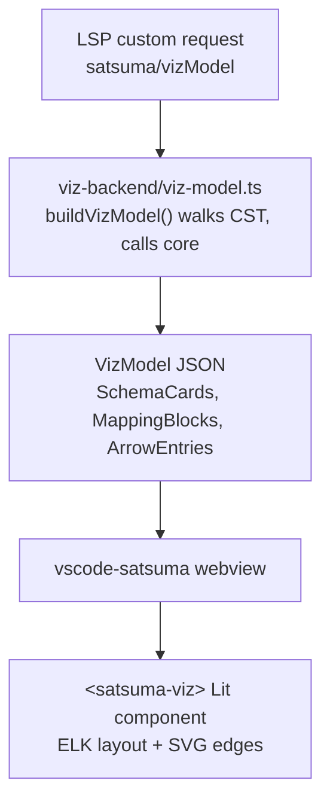

# Satsuma-Lang: A Contributor's Deep-Dive Guide

Last reviewed: 2026-04-07.

## What Is This Codebase?

Satsuma is a domain-specific language (DSL) for describing source-to-target data mappings. Think of it as a replacement for the massive Excel spreadsheets and wiki pages that enterprises use to document how data moves between systems. The language has a parser, a parser-backed CLI command suite, a Language Server Protocol (LSP) implementation, a VS Code extension, and an interactive visualisation component — all in TypeScript, all under `tooling/`.

The language itself sits at an unusual intersection: schemas and field mappings are deterministically parsed, while natural-language annotations ("trim whitespace, apply business rule X") are preserved verbatim for humans or LLMs to interpret. This duality — structural rigour where possible, NL flexibility where needed — is the central design idea.

---

## Architecture at a Glance

The codebase is organised as a strict layer cake of 9 packages. Dependencies flow **downward only** — a rule enforced by convention, not by tooling (there is no build-time cycle checker).



The cardinal rule: **core never imports from CLI, LSP, or viz.** The CLI never imports from the LSP. The LSP never imports from the CLI. This is well-maintained — I found no violations.

### Package Responsibilities

**`tree-sitter-satsuma`** — The grammar definition (`grammar.js`). This is the single source of truth for what constitutes valid Satsuma syntax. It generates a WASM parser that every other package consumes. It also owns corpus test fixtures and tree-sitter highlight queries.

**`satsuma-core`** — The semantic extraction library. All pure, no-I/O logic for turning Concrete Syntax Trees (CSTs) into typed domain objects lives here: schema extraction, field tree building, arrow classification, metadata parsing, spread expansion, NL reference resolution, validation, and formatting. This is the heart of the system. It accepts CST nodes and returns plain data — no filesystem, no LSP types, no CLI types.

**`satsuma-cli`** — The command-line tool. Its commands orchestrate file discovery, import following, workspace index building, and output formatting. It calls core for all extraction and adds file I/O, a lint engine, a diff engine, and human/JSON output formatting on top.

**`satsuma-lsp`** — The Language Server Protocol server. Editor-agnostic (works with VS Code, Neovim, Helix, etc.). Provides hover, completions, go-to-definition, find-references, rename, CodeLens, semantic tokens, diagnostics, and formatting. Delegates all CST extraction to core.

**`satsuma-viz-backend`** — The shared library for building `VizModel` payloads. Contains the workspace index used by both the LSP and the viz test harness. This is the deduplication point that prevents the LSP and harness from depending on each other.

**`satsuma-viz-model`** — Pure TypeScript interfaces defining the `VizModel` JSON contract between server and client. No logic — only types. This is the serialisation boundary between processes.

**`satsuma-viz`** — A Lit web component (`<satsuma-viz>`) that renders a VizModel as an interactive schema-mapping diagram. Uses ELK.js for layout and SVG for edge rendering. It consumes `VizModel` JSON and imports small shared helpers from core, such as coverage and NL reference utilities.

**`vscode-satsuma`** — The VS Code extension: extension activation, webview panel management, command registration, and the TextMate grammar for syntax highlighting.

**`satsuma-viz-harness`** — A standalone HTTP server + browser client for Playwright-driven testing of the viz component without VS Code in the loop.

---

## How Data Flows

Understanding the three main data paths is essential to navigating the code.

### Path 1: CLI — File to Command Output



The CLI's `ExtractedWorkspace` (defined in `types.ts` — renamed from `WorkspaceIndex` in sl-erxz to make its role as an extraction *result* explicit and avoid the name clash with viz-backend's editor index) is a flat collection of `Map<string, Record>` objects — schemas, metrics, mappings, fragments, transforms, plus arrays for notes, warnings, arrows, and NL ref data. It is rebuilt from scratch on every invocation (files are small; full re-parse takes <100ms).

### Path 2: LSP — Document Change to IDE Feature



The LSP's `WorkspaceIndex` (defined in viz-backend) is a different shape entirely: it stores `DefinitionEntry` and `ReferenceEntry` objects with LSP `Range` positions, keyed by symbol name, and is updated incrementally per-file. It kept the `WorkspaceIndex` name in sl-erxz because it is the naturally editor-shaped index; the CLI's batch result type was the one that got renamed (to `ExtractedWorkspace`).

### Path 3: Viz — Server to Rendering



---

## The Most Important Functions and Interfaces

### In `satsuma-core`

| Function / Type | File | What It Does |
|---|---|---|
| `extractSchemas(rootNode)` | `extract.ts` | Returns all `ExtractedSchema` objects from a CST root — name, namespace, note, fields, spreads, position |
| `extractArrowRecords(rootNode)` | `extract.ts` | Returns all `ExtractedArrow` objects — source paths, target path, pipe steps, classification, metadata |
| `extractFieldTree(bodyNode)` | `extract.ts` | Recursively builds a `FieldDecl[]` tree from a `schema_body` node, handling records, lists, and spreads |
| `extractMetadata(node)` | `meta-extract.ts` | Parses `metadata_block` nodes into typed `MetaEntry` discriminated unions (tag, kv, enum, note, slice) |
| `classifyTransform(steps)` | `classify.ts` | Returns `"nl"` if the pipe chain has steps, `"none"` if empty. Trivially simple after Feature 28 removed structural transforms |
| `expandEntityFields(entity, ns, resolver, lookup)` | `spread-expand.ts` | Expands fragment `...spread` references into concrete fields, using callbacks to resolve cross-file fragments |
| `resolveRef(ref, context, lookup)` | `nl-ref.ts` | Resolves a single `@ref` token from an NL transform string against the workspace, returning resolution status and target |
| `collectSemanticDiagnostics(index)` | `validate.ts` | Runs 9 categories of semantic checks (duplicates, unresolved spreads, bad arrow paths, NL ref validation, import scoping, etc.) against a `SemanticIndex` |
| `format(source)` | `format.ts` | Canonical code formatter — parses, re-emits with consistent indentation and spacing |
| `canonicalRef(ns, schema, field?)` | `canonical-ref.ts` | Builds the canonical `ns::schema.field` reference string used everywhere |
| `SyntaxNode` | `types.ts` | The tree-sitter node interface — the universal input type for all core functions |
| `FieldDecl` | `types.ts` | The extracted field shape — name, type, children, isList, metadata, spreads, position |

### In `satsuma-cli`

| Function / Type | File | What It Does |
|---|---|---|
| `loadWorkspace(pathArg)` | `load-workspace.ts` | The one-call workspace loader used by 18 of 21 CLI commands — resolves the path argument, parses the files, builds the index, and reports any resolve failure with a single consistent `Error resolving path '<arg>': ...` message. Returns `{ files, index }`. |
| `buildIndex(parsedFiles)` | `index-builder.ts` | The big assembler — takes parsed files, calls every core extractor, builds the full `ExtractedWorkspace` with deduplication and cross-reference graph. Usually invoked indirectly via `loadWorkspace`. |
| `ExtractedWorkspace` | `types.ts` | The CLI's workspace model — maps of schemas, metrics, mappings, fragments, transforms, plus arrows, notes, warnings, NL ref data, duplicates |
| `resolveInput(pathArg)` | `workspace.ts` | Lower-level primitive — takes a `.stm` path, follows imports transitively, returns all reachable file paths. Called directly only by `fmt` / `diff` / `validate` (which have custom error handling) and by `loadWorkspace` itself. |
| `buildFullGraph(index)` | `graph-builder.ts` | Constructs a schema-level directed graph (nodes + edges) from the workspace index, including NL-derived edges |
| `diffIndex(indexA, indexB)` | `diff.ts` | Structural comparison of two workspace snapshots — field additions/removals, type changes, arrow changes |
| `RULES` | `lint-engine.ts` | The lint rule registry — currently 3 rules (hidden-source-in-nl, unresolved-nl-ref, duplicate-definition) |

### In `satsuma-lsp` / `satsuma-viz-backend`

| Function / Type | File | What It Does |
|---|---|---|
| `createWorkspaceIndex()` / `indexFile()` | `viz-backend/workspace-index.ts` | Creates and incrementally updates the definition/reference index used for IDE features |
| `buildVizModel(uri, tree, index)` | `viz-backend/viz-model.ts` | Walks a CST and produces the full `VizModel` payload for the viz component; this remains the largest single builder cluster |
| `mergeVizModels(uri, models)` | `viz-backend/viz-model.ts` | Merges per-file VizModels into a cross-file lineage view |
| `computeDefinition()` | `lsp/definition.ts` | Go-to-definition: finds the definition of a symbol under the cursor |
| `computeCompletions()` | `lsp/completion.ts` | Auto-complete: suggests schema names, field names, and fragment names in context |
| `computeHover()` | `lsp/hover.ts` | Hover tooltips: shows field types, schema shapes, and transform classifications |

### The Callback Pattern (ADR-005 / ADR-006)

Core's cross-file operations need workspace data but must not depend on any specific workspace index type. The solution is **callback interfaces**:

- `EntityRefResolver` — resolves a potentially-unqualified entity reference to its canonical key
- `SpreadEntityLookup` — looks up an entity's fields by key
- `DefinitionLookup` — full lookup interface for NL ref resolution (hasSchema, getSchema, expandSpreads, etc.)
- `SemanticIndex` — provides all entities for validation

Each consumer (CLI, LSP, viz-backend) creates these callbacks from its own index type in 3–5 lines. The CLI does this in `spread-expand.ts` and `nl-ref-extract.ts` — permanent (per ADR-005/006) thin bridge modules that adapt `ExtractedWorkspace` to core's callback APIs.

---

## Key Design Decisions (ADRs Worth Reading)

The `adrs/` directory records the major Architecture Decision Records. The most important for a new contributor:

- **ADR-003 / ADR-020**: Core as the single extraction truth. All CST-to-data logic goes through core. Consumers never do their own extraction.
- **ADR-005**: Callback abstractions for spread expansion. Core defines minimal callback types; consumers wire them from their own indexes.
- **ADR-006**: NL reference resolution boundary. Same callback strategy for `@ref` resolution in NL transforms.
- **ADR-008**: Fragment spread expansion semantics — how `...fragment_name` resolves.
- **ADR-022**: File-based workspace model with transitive imports. The workspace boundary is defined by a single entry file and its import graph, not by directory scanning.
- **ADR-010**: LSP server architecture.
- **ADR-021**: Extraction of `satsuma-viz-backend` from the LSP to enable shared workspace indexing.

---

## The Test Suite

The test suite is broad and deliberately layered. Avoid duplicating the same invariant across layers: core extraction belongs in core tests, CLI output contracts belong in CLI tests, and LSP protocol behaviour belongs in LSP tests.

**Core tests** (`satsuma-core/test/`, `.js` files): Unit-test extraction, classification, formatting, validation, and NL ref resolution against minimal `.stm` snippets. These are the ground truth — if a behaviour is tested here, consumers should not re-test it.

**CLI tests** (`satsuma-cli/test/`, `.ts` files): Integration tests that exercise the full pipeline from `.stm` source text to command output. Tests cover the command suite, the diff engine, the lint engine, graph builders, namespace handling, recovery behaviour, and text/JSON formatting contracts.

**LSP tests** (`satsuma-lsp/test/`, `.js` files): Tests for each LSP feature (hover, completions, definition, references, rename, CodeLens, semantic tokens, diagnostics, formatting, folding, and custom viz requests) against small `.stm` fixture strings.

**Smoke tests** (`smoke-tests/`): Python/pytest BDD-style tests that invoke the compiled CLI binary and assert on its output. These are the outermost integration layer.

**Grammar corpus** (`tree-sitter-satsuma/test/corpus/`): Tree-sitter's built-in test format — input `.stm` snippets paired with expected CST shapes. The recovery corpus includes deliberately malformed mid-edit states and should grow with parser recovery work.

---

## Current Rough Edges

### 1. Duplicated `SyntaxNode` / `Tree` / `FieldDecl` / `PipeStep` / `Classification` Types

The CLI defines its **own** `SyntaxNode`, `Tree`, `FieldDecl`, `PipeStep`, and `Classification` interfaces in `satsuma-cli/src/types.ts` that are structurally identical to the ones in `satsuma-core/src/types.ts`. The CLI's `SyntaxNode` is even slightly divergent (it lacks the optional `childForFieldName?` method that core has).

These are not re-exports — they are independently maintained copies. The CLI's `FieldDecl` imports `MetaEntry` from core (creating a cross-type dependency), but the top-level shape is re-declared. This is the single largest source of conceptual confusion for a new contributor: which `FieldDecl` am I looking at?

**Impact**: Low runtime risk (structural typing means they're compatible), but high cognitive overhead and risk of silent divergence.

### 2. Duplicated `web-tree-sitter.d.ts`

The file `web-tree-sitter.d.ts` (213 lines of tree-sitter type declarations) is byte-for-byte identical in `satsuma-cli/src/` and `satsuma-lsp/src/`. It should live in one place (core, or a shared `@types` package).

### 3. Three Different `parser-utils.ts` / `parser.ts` Files

The parser is initialised in core (`satsuma-core/src/parser.ts`), then wrapped with thin file-I/O helpers in the CLI (`satsuma-cli/src/parser.ts`), re-exported with type-casting wrappers in the LSP (`satsuma-lsp/src/parser-utils.ts`), and re-exported again in the viz-backend (`satsuma-viz-backend/src/parser-utils.ts`). Each wrapper adds a `parseSource()` convenience function, a `nodeRange()` helper, and re-exports of `child`, `children`, `labelText`, `stringText`, `walkDescendants` from core — cast to the local `Node` type.

The LSP and viz-backend wrappers are nearly identical (both create `nodeRange` using `vscode-languageserver`'s `Range.create`). The viz-backend version is 32 lines; the LSP version is 91 lines because it also wraps five CST navigation functions purely for type compatibility.

### 4. Two Graph Builders in the CLI

There are **two** files named `graph-builder.ts` in the CLI:

- `satsuma-cli/src/graph-builder.ts` (113 lines) — builds a schema-level `FullGraph` (nodes + edges). Used by the `lineage` and `graph` commands.
- `satsuma-cli/src/commands/graph-builder.ts` (618 lines) — builds a richer `WorkspaceGraph` with both schema-level and field-level edges, NL text, and namespace filtering. Used only by the `graph` command.

The smaller one builds a simpler graph; the larger one builds a superset. But they share significant logic (node collection, NL @ref edge derivation) with no code sharing between them. The NL ref edge-promotion logic is duplicated across both files and also in `lint-engine.ts`.

### 5. The `viz-model.ts` Import Dance

In `satsuma-viz-backend/src/viz-model.ts`, every VizModel type is imported **twice** — once as a re-export (`export type { VizModel, ... } from "@satsuma/viz-model"`) and then again as a local import for use within the file (`import type { VizModel, ... } from "@satsuma/viz-model"`). This is 40 lines of pure ceremony. A single `import` plus a barrel re-export would halve this.

### 6. Architecture Diagram vs Reality: `satsuma-viz` Depends on Core

`tooling/ARCHITECTURE.md` still says `satsuma-viz` consumes only `VizModel` JSON and has no dependency on core. That is no longer true: `package.json` lists `@satsuma/core` as a direct dependency, and the source imports shared coverage and NL ref helpers from core. The dependency matrix should show a `satsuma-viz -> core` edge.

### 7. The CLI Bridges Are Permanent (and That Is Fine)

Both `satsuma-cli/src/spread-expand.ts` and `satsuma-cli/src/nl-ref-extract.ts` are thin bridge modules that adapt the CLI's `ExtractedWorkspace` to core's callback-based APIs (per ADR-005 / ADR-006). Earlier drafts of this guide called them temporary shims slated for removal in sl-n4wb; that ticket closed and the bridges were rejustified as permanent in sl-y0sz. They are the canonical place where CLI-shaped data meets core's callbacks — exactly one well-named module per callback interface — and they are not technical debt.

### 8. (Resolved) Excessive `process.exit()` — Was 53 Calls

Resolved in sl-3291. The CLI used to have 53 inline `process.exit()` calls across 23 command files, making error paths essentially untestable without subprocess spawning. They were replaced with a single dispatcher in `satsuma-cli/src/command-runner.ts`: handlers either return a numeric exit code or throw a `CommandError`, and `runCommand` catches both and exits exactly once via `flushAndExit` (which drains stdout/stderr first — also fixed a latent `--json` truncation past ~64KiB on piped output). `errors.ts` (`loadFiles`, `notFound`) and `load-workspace.ts` throw `CommandError` instead of exiting. Down to two intentional exit sites: the runner itself, and an `unhandledRejection` safety net in `index.ts` for failures *before* dispatch. The `errors.test.ts` and `load-workspace.test.ts` rewrites dropped all `process.exit` stub plumbing in favour of asserting thrown `CommandError`s directly.

### 9. Two Workspace Index Shapes (Now Distinctly Named)

The CLI and the viz-backend both need to hold cross-file workspace data, but with very different shapes. The CLI uses `ExtractedWorkspace` (in `satsuma-cli/src/types.ts`) — a flat batch result of `Map<string, SchemaRecord>` entries built once per invocation. The viz-backend uses `WorkspaceIndex` (in `satsuma-viz-backend/src/workspace-index.ts`) — an incrementally updated `Map<string, DefinitionEntry[]>` with LSP `Range` positions used for IDE features. Until sl-erxz both types were called `WorkspaceIndex`, which was a real source of confusion; the rename to `ExtractedWorkspace` makes the CLI type's role as an extraction *result* explicit and removes the collision.

### 10. The LSP Still Shells Out to the CLI for Full Validation

`satsuma-lsp/src/validate-diagnostics.ts` runs `satsuma validate --json` as a **child process** on file save, parses the JSON stdout, and converts it to LSP diagnostics. The validation pipeline is less fragmented than it used to be: core now exposes `validateSemanticWorkspace()`, and both the CLI and LSP consume that shared entry point for reachability-aware semantic checks.

The remaining gap is that full CLI validation still runs out-of-process from the LSP. That keeps a process boundary, JSON parsing step, timeout, and diagnostic merge logic in the editor path. If the LSP/viz-backend workspace index tracked all data needed by core validation, the LSP could do the full check in-process.

### 11. Hand-Rolled `pathToFileUri` vs. Standard `pathToFileURL`

In `validate-diagnostics.ts`, a hand-rolled `pathToFileUri()` function (`"file://" + encodeURI(fsPath).replace(/#/g, "%23")`) converts filesystem paths to URIs. Node.js's standard `url.pathToFileURL()` is available and used elsewhere in the same codebase (e.g., in `server.ts`). The hand-rolled version will break on Windows paths and paths with special characters.

### 12. The Large `viz-model.ts` Builder

`satsuma-viz-backend/src/viz-model.ts` is the largest file in the codebase and contains the `buildVizModel()` function plus many helper functions for extracting schema cards, mapping blocks, arrow entries, metric cards, fragment cards, notes, comments, metadata, each-blocks, flatten-blocks, and source-block info from the CST. It does everything: CST walking, core extractor calls, spread expansion, NL @ref resolution, metadata interpretation, and VizModel assembly.

This file is doing the job of a small module system. A contributor needing to modify how schemas are visualised must navigate a large builder file to find the right helper. Breaking it into `schema-builder.ts`, `mapping-builder.ts`, `metric-builder.ts`, and `fragment-builder.ts` would make it far more approachable.

### 13. Inconsistent Import Style: Barrel vs. Subpath

Most packages import from the barrel export (`import { format } from "@satsuma/core"`), but the CLI's `format.ts` imports via a subpath (`from "@satsuma/core/format"`) and the viz component imports via subpaths (`from "@satsuma/core/coverage-paths"`). This inconsistency signals that the barrel export might be missing some entries, or that the subpath convention is not agreed-upon.

### 14. Inconsistent Test File Extensions

Core tests are `.js` files. CLI tests are `.ts` files. LSP tests are `.js` files. There's no documented reason for this inconsistency. The core and LSP tests import from compiled output (`../src/index.js`); the CLI tests import from TypeScript source via `tsx`. This means you need different mental models for running tests in different packages (`node --test` for core/LSP, `node --import tsx/esm --test` for CLI).

### 15. The Lint Engine Has Only 3 Rules

`lint-engine.ts` defines a full rule registry, runner, and fix-application framework — but currently houses only 3 rules. The framework is well-designed (rules receive an `ExtractedWorkspace` and return `LintDiagnostic[]` with optional auto-fix functions), but the validation logic in `core/validate.ts` (9 check categories, ~900 lines) was not built on top of this framework. The result is two parallel validation systems with overlapping coverage: `validate` produces `SemanticDiagnostic` objects, while `lint` produces `LintDiagnostic` objects.

### 16. NL Ref Edge-Counting Logic Is Triplicated

The logic for counting NL-derived edges appears in three places:

1. `satsuma-cli/src/graph-builder.ts` — when building the schema-level graph
2. `satsuma-cli/src/commands/graph-builder.ts` — when building the field-level graph
3. `satsuma-cli/src/nl-ref-extract.ts` (`countNlDerivedEdgesByMapping`) — for the `summary` command

Each reimplements the same deduplication rules (skip self-references, skip if a declared arrow already covers the source→target pair). A single canonical function in core, taking callbacks, would eliminate this.

---

## What It Would Take to Be World-Class

The codebase is already better-structured than most projects its size. The layered architecture is sound, the ADRs are thoughtful, the test coverage is strong, and the documentation (ARCHITECTURE.md, AGENTS.md, lessons/) is exceptional. Here is what separates it from truly world-class:

### 1. Collapse the Type Duplication

Define `SyntaxNode`, `Tree`, `FieldDecl`, `PipeStep`, `Classification`, and all other shared types **once** in `satsuma-core/src/types.ts` and import them everywhere. The CLI's `types.ts` should contain only CLI-specific types (`SchemaRecord`, `ArrowRecord`, `ExtractedWorkspace`, etc.) and re-export core types. Delete the duplicated `web-tree-sitter.d.ts`. This is the single highest-leverage cleanup: it eliminates an entire category of "which type am I looking at?" confusion.

### 2. (Resolved) The CLI Bridges Are Permanent

An earlier version of this guide listed "kill the shims" as a target. After sl-n4wb closed and the modules were rejustified in sl-y0sz, the conclusion is the opposite: `spread-expand.ts` and `nl-ref-extract.ts` are the canonical CLI ↔ core callback adapters and should stay. No action.

### 3. (Resolved) `WorkspaceIndex` Naming Collision

The CLI's batch result type was renamed from `WorkspaceIndex` to `ExtractedWorkspace` in sl-erxz. The viz-backend keeps `WorkspaceIndex` because it is the naturally editor-shaped index. No further action.

### 4. (Resolved) Replace `process.exit()` with Typed Errors

Resolved in sl-3291. The CLI now has a single dispatcher (`src/command-runner.ts`) with a `CommandError` class and a `runCommand` wrapper around every Commander `.action()`. Handlers return a numeric exit code or throw `CommandError`; the runner catches both, prints to the requested stream, drains stdout/stderr, and exits once. See "Resolved Issue 9" above.

### 5. Break Up `viz-model.ts`

Split the large VizModel builder into per-entity-type modules: `build-schema-card.ts`, `build-mapping-block.ts`, `build-metric-card.ts`, `build-fragment-card.ts`, plus a top-level `build-viz-model.ts` orchestrator. Each module becomes independently testable and navigable.

### 6. Consolidate the Two Graph Builders

The 113-line `src/graph-builder.ts` and the 618-line `src/commands/graph-builder.ts` should be merged into a single module with options for schema-only vs. field-level output. The shared NL-ref edge promotion logic should be a single function.

### 7. Unify the Validation Pipeline

Merge the lint engine and the semantic validator into a single diagnostic framework. Rules should be pluggable (the lint engine's `LintRule` interface is good). The current split — `validate.ts` in core producing `SemanticDiagnostic`, `lint-engine.ts` in CLI producing `LintDiagnostic`, and the LSP running both plus a CLI subprocess — has too many moving parts. A single `DiagnosticRule` interface in core, with a registry that both CLI and LSP can query, would simplify the entire stack.

### 8. Move Arrow Extraction to the LSP Workspace Index

The LSP shells out to the CLI for validation because its workspace index doesn't store arrow records. If the viz-backend's workspace index also tracked arrows (via core's `extractArrowRecords`), the LSP could run the full semantic validator in-process, eliminating the subprocess, the JSON parsing, the deduplication, and the 15-second timeout. This is the biggest architectural gap.

### 9. Add Build-Time Dependency Enforcement

The layering rules are enforced by convention. A tool like `dependency-cruiser` or `eslint-plugin-import` with forbidden-pattern rules could catch violations at CI time. Also: fix the `ARCHITECTURE.md` dependency matrix to reflect that `satsuma-viz` depends on `satsuma-core`.

### 10. Standardise Test Infrastructure

Pick one extension (`.ts` with `tsx` runner, or `.js` with pre-compiled imports) and use it everywhere. Add a top-level `npm test` that runs all packages. Consider a monorepo tool (Turborepo, Nx) to manage the multi-package build graph with proper caching.

### 11. Extract `nodeRange` and Parser Wrappers

The `nodeRange()` function and `parseSource()` convenience wrapper are duplicated between the LSP and viz-backend `parser-utils.ts` files. Move them to `satsuma-core` (or a new `satsuma-shared` package) since they depend only on `vscode-languageserver` types, which the viz-backend already imports.

### 12. Property-Based and Fuzz Testing for the Grammar

The grammar has a large hand-crafted corpus, but no property-based generator. Adding property-based tests (generate random valid `.stm` files from the grammar, assert that parse → extract → format → re-parse produces the same extraction) would catch an entire class of round-trip bugs. Tree-sitter's fuzzing support could also be leveraged.

### 13. Telemetry / Performance Baselines

The architecture notes say "full re-parse is <5ms" and "operations complete in <100ms" — but there are no benchmarks in the repo to verify this or detect regressions. A small benchmark suite (parse 100 files, build index, run validation, format all) with CI tracking would establish and protect these guarantees.

### 14. Keep Expanding Error Recovery Testing

The ARCHITECTURE.md states "parsing never fails — CST always produced, errors embedded" and "IDE features should be partially available even when the workspace has errors." Feature 29 added focused recovery corpus, CLI recovery, and LSP recovery coverage. Keep growing that suite whenever new recovery-sensitive behaviour lands; malformed input tests are now part of the expected implementation surface.

---

## Recommended Refactorings (Prioritised)

These are concrete, incremental improvements ordered by impact-to-effort ratio. None requires a rewrite; each can be landed as a single PR.

### Tier 1 — High Impact, Low Risk (do first)

**R1. Delete the CLI's duplicate type declarations.**
The CLI's `types.ts` defines its own `SyntaxNode`, `Tree`, `FieldDecl`, `PipeStep`, and `Classification` that shadow core's. Replace them with re-exports from `@satsuma/core`. The CLI-only types (`SchemaRecord`, `ExtractedWorkspace`, `ArrowRecord`, `LintDiagnostic`, etc.) stay. This is a search-and-replace job — structural typing means nothing breaks at runtime — but it eliminates the biggest "which type am I looking at?" trap for every future contributor. A single PR, zero behavioural change.

**R2. ~~Delete the dead `resolveAndLoad` function or wire it up.~~ (Wired up — sl-r39t)**
`errors.ts` previously exported a `resolveAndLoad()` convenience wrapper with zero callers. Rather than delete it, sl-r39t introduced a small dedicated module — `satsuma-cli/src/load-workspace.ts` — that owns the canonical "resolve a path argument → parse files → build the workspace index" pipeline. 18 of the 21 CLI commands now call `loadWorkspace(pathArg)` and consume `{ files, index }` directly, eliminating ~140 lines of duplicated `try { resolveInput } catch { print; exit } / parseFile / buildIndex` boilerplate and giving the whole CLI one consistent error message format. The three commands that opt out — `fmt` (per-file parse-error tolerance), `diff` (two-path comparison with `followImports: false`), and `validate` (JSON-formatted resolve errors) — have genuinely different error semantics; pushing their needs into option flags on the loader would just shift complexity rather than reduce it.

**R3. ~~Collapse the shim modules.~~ (Won't do — sl-y0sz)**
`satsuma-cli/src/spread-expand.ts` and `nl-ref-extract.ts` were rejustified in sl-y0sz as permanent CLI ↔ core callback bridges (ADR-005 / ADR-006). The previous header comments claiming they would be removed in sl-n4wb were stale; they have been rewritten to describe the modules' permanent role.

**R4. Deduplicate `web-tree-sitter.d.ts`.**
The 213-line type declaration file is byte-for-byte identical in CLI and LSP. Move it to `satsuma-core` (or a shared `@types` directory) and import from there.

**R5. Fix the `ARCHITECTURE.md` dependency matrix.**
The matrix claims `satsuma-viz` has no dependency on `satsuma-core`. It does — for `coverage-paths`. Update the table and the prose. This is a one-line documentation fix but it prevents a new contributor from building a wrong mental model.

### Tier 2 — Medium Impact, Moderate Effort

**R6. ~~Extract a command harness to kill the per-command boilerplate.~~ (Partially done — sl-r39t)**
The "resolve → parse → build index" half of this dance is now owned by `load-workspace.ts`'s `loadWorkspace()`, which 18 commands call in a single line. Typical usage:

```typescript
async function schemaCommand(name: string, pathArg: string | undefined) {
  const { files, index } = await loadWorkspace(pathArg);
  const resolved = resolveIndexKey(name, index.schemas);
  // … look up entity, handle not-found, print
}
```

The "entity lookup + not-found + suggestion" half is still per-command because the error formatting varies meaningfully across the 16 commands (different JSON shapes, different kinds of suggestion). A full `CommandContext` harness would be the next step; now that R7 has landed (sl-3291) every command throws `CommandError` consistently, so the harness shape is no longer blocked on the exit-policy decision.

**R7. (Done — sl-3291) Replace `process.exit()` with typed errors.**
Landed: `src/command-runner.ts` exposes `CommandError` + `runCommand`. Every command's `.action()` is wrapped, every handler either returns a numeric exit code or throws `CommandError`, and the runner is the single place that calls `process.exit`. The integration tests continue to work unchanged. Two intentional exit sites remain (runner + pre-dispatch safety net), both documented in their files.

**R8. Merge the two graph builders.**
`src/graph-builder.ts` (113 lines) builds schema-level graphs. `src/commands/graph-builder.ts` (618 lines) builds schema+field-level graphs. They share node-collection and NL-ref-edge-promotion logic with no code sharing. Merge into a single module with a `schemaOnly` option. Extract the NL-ref edge promotion into a shared function and reuse it in `lint-engine.ts` and `nl-ref-extract.ts::countNlDerivedEdgesByMapping` as well, eliminating the triplication.

**R9. Break up `viz-model.ts`.**
The large `satsuma-viz-backend` builder can be split into `build-schema-card.ts`, `build-mapping-block.ts`, `build-metric-card.ts`, `build-fragment-card.ts`, and an orchestrating `build-viz-model.ts`. Each builder becomes independently navigable and testable. The `buildVizModel` function remains the public API — it just delegates internally.

**R10. Fix the `pathToFileUri` hand-roll.**
Replace the hand-rolled URI conversion in `validate-diagnostics.ts` with Node.js's standard `url.pathToFileURL()`. The current implementation will break on Windows paths and paths with certain special characters.

### Tier 3 — High Impact, High Effort (plan carefully)

**R11. Unify the validation pipeline.**
The codebase has three diagnostic producers that partially overlap: tree-sitter parse errors, core's `collectSemanticDiagnostics`, and the CLI's lint engine. The LSP runs all three plus a CLI subprocess, then deduplicates by `rule:line`. Redesign this as a single `DiagnosticRule` interface in core with a registry. Each rule declares its inputs (CST only, CST + index, CST + index + arrows). The CLI and LSP query the registry with whatever data they have. Rules that need arrows only run when arrows are available. This eliminates the subprocess, the deduplication, and the two-parallel-systems problem.

**R12. Add arrow records to the LSP workspace index.**
The viz-backend's workspace index tracks definitions and references but not arrow records. This is why the LSP shells out to the CLI for full validation. If the workspace index also stored `ExtractedArrow` data (via core's `extractArrowRecords`), the LSP could run the full semantic validator in-process, eliminating the 15-second-timeout subprocess, the JSON stdout parsing, and the fragile deduplication logic.

**R13. ~~Rename the two `WorkspaceIndex` types.~~ (Done — sl-erxz)**
The CLI's batch type was renamed to `ExtractedWorkspace`; viz-backend's editor index keeps `WorkspaceIndex`. The naming collision is gone.

---

## What I'd Do Differently from Scratch

If I were designing this system with today's knowledge and a blank slate, here's what would change. These are not criticisms of the existing design — many of these choices were made for good reasons at the time (speed of iteration, evolving requirements, solo-developer pragmatism). But hindsight is free.

### 1. One workspace index, not two

The biggest structural tension in the codebase is that the CLI and the LSP each have their own workspace data structure with different shapes, different update semantics, and different data. The CLI's `ExtractedWorkspace` is a flat `Map<string, Record>` structure rebuilt from scratch on every invocation. The viz-backend's `WorkspaceIndex` is an incremental `Map<string, DefinitionEntry[]>` that tracks LSP `Range` positions.

From scratch, I'd define **one** workspace index type in core with a clear interface: `addFile(uri, tree)`, `removeFile(uri)`, `getSchema(name)`, `getArrows(mappingName)`, `iterateAll()`. The index would store core extraction results (the `Extracted*` types) enriched with source positions. The CLI would build it in batch mode (add all files, query, discard). The LSP would build it incrementally (add/update on change, query on request). The index type would live in core and would not contain any LSP-specific types like `Range` — consumers would convert positions at the boundary.

This one change would eliminate: the two parallel workspace types, the CLI ↔ core callback bridges, the missing-arrow-records gap that forces the LSP to subprocess, and the divergent duplicate-detection logic.

### 2. Result types, not `process.exit()`

From day one, every function that can fail would return `Result<T, SatsumaError>` (or throw a typed error — either pattern works in TypeScript). No function would ever call `process.exit()`. The CLI entry point would be a thin shell that calls the real logic, catches errors, and maps them to exit codes and stderr messages. This makes every piece of logic testable without subprocess spawning, and it makes the CLI embeddable as a library (which matters for the VS Code extension integration and for programmatic consumers). The throw-typed-error half of this landed retroactively in sl-3291 — see `src/command-runner.ts`.

### 3. The grammar would own the node-type string constants

Currently, CST node type strings like `"schema_block"`, `"mapping_block"`, `"field_decl"`, `"pipe_step"`, `"source_ref"` appear as string literals scattered across every package. A typo in any of them is a silent bug. I'd generate a `NodeTypes` enum or const object from `tree-sitter-satsuma/src/node-types.json` at build time and use it everywhere. A grammar change that renames a node type would then produce compile errors instead of silent breakage.

### 4. Commands as pure functions, not Commander registrations

Each CLI command currently mixes three concerns: Commander option parsing, workspace orchestration (resolve files, build index), and business logic (query index, format output). I'd separate these completely:

- **Command functions** are pure: `(index: ExtractedWorkspace, options: SchemaOpts) → SchemaResult`. No I/O, no side effects. Trivially testable.
- **Formatters** convert results to human text or JSON: `(result: SchemaResult, format: "text" | "json") → string`.
- **CLI wiring** handles Commander registration, file resolution, index building, and output writing. One thin orchestrator per command, or even a single generic one.

This would eliminate the 200+ lines of per-command boilerplate, make unit testing straightforward (no subprocess spawning needed), and allow the CLI logic to be consumed as a library by the LSP extension (instead of shelling out to the CLI binary for validation).

### 5. A monorepo tool from the start

The current setup is a manual monorepo: 9 packages with independent `package.json` files, no workspace-level `npm test`, a 500-character `install:all` script that serially installs each package. There's no build caching, no dependency graph-aware task runner, no way to run "tests affected by this change."

From scratch I'd use `npm workspaces` (or Turborepo/Nx) from the beginning. Benefits: single `npm install`, automatic workspace symlinks, parallel builds with caching, `turbo run test --filter=...[HEAD~1]` for affected-only CI, and a single lockfile. The layered dependency graph is already clean enough to benefit immediately.

### 6. The viz-model contract would use JSON Schema, not TypeScript interfaces

`satsuma-viz-model` defines the serialisation boundary between the server (LSP/harness) and the client (web component) as TypeScript interfaces. But this contract crosses a process boundary — the server serialises JSON, the client parses it. TypeScript interfaces provide no runtime validation.

I'd define the VizModel as a JSON Schema (or Zod schema, or similar) with generated TypeScript types. This gives: runtime validation at the boundary (catch contract violations before they become rendering bugs), auto-generated documentation, and the ability to version the schema independently of the TypeScript code.

### 7. Coverage logic in one place

Field coverage logic is currently scattered across four files in three packages: `core/coverage.ts` (path prefix expansion), `core/coverage-paths.ts` (covered-field-set building), `viz/field-coverage.ts` (mapping-level coverage for the web component), and `lsp/coverage.ts` (per-field coverage for CodeLens decorations). Each reimplements parts of the same "which fields are covered by arrows?" question.

I'd put all coverage computation in core behind a single function: `computeCoverage(schema, arrows, fragments) → CoverageResult`. The result would include per-field coverage status, coverage percentage, and uncovered field paths. The viz component and LSP would consume this result object instead of each re-deriving coverage from raw data.

### 8. The NL ref regex would be a grammar rule, not a hand-written regex

The `@ref` pattern (matching `@identifier`, `@schema.field`, `@ns::schema.field`, `` @`backtick` `` variants) is implemented as a hand-written regex factory in core (`createAtRefRegex`) and reused by consumers. This avoids copy-paste drift, but the pattern is still part of the language's semantics — it defines what constitutes a cross-reference inside natural language text.

I'd make `@ref` a first-class grammar construct inside `nl_string` and `multiline_string` nodes, so tree-sitter parses them structurally. The extractor would then walk `at_ref` CST nodes instead of running a regex over string content. This makes @ref parsing testable via the grammar corpus and enables syntax highlighting of @refs in the TextMate grammar for free.

### 9. Tests would use a snapshot pattern, not assert-per-field

The CLI test suite still contains many assertions of the form `assert.equal(data.schemas[0].name, "foo")` / `assert.equal(data.schemas[0].fields.length, 3)` — testing one field at a time. Snapshot-style assertions (`assert.deepStrictEqual(data, expectedSnapshot)`) can reduce maintenance while increasing coverage (a snapshot catches unexpected extra fields; individual asserts don't). Jest snapshots or inline snapshot objects both work. The tradeoff is readability of failure messages, but for structured data extraction, snapshots are often the right call.

### 10. Incremental parsing from the start

The architecture notes say "full re-parse is <5ms" and "incremental computation is not needed." This is true today with small files. But it's a decision that becomes harder to reverse as adoption grows. Tree-sitter natively supports incremental parsing (you pass the old tree + the edit range, and it only re-parses the changed region). I'd wire this up from the beginning in the LSP, not because it's needed now, but because it's essentially free (tree-sitter does the work) and it future-proofs the architecture for larger files.

---

## Summary: What a New Contributor Should Know

1. **Start in `satsuma-core`**. Read `types.ts`, then `extract.ts`, then `cst-utils.ts`. These three files define the vocabulary of the entire system.

2. **Understand the callback pattern**. Core uses `EntityRefResolver`, `SpreadEntityLookup`, `DefinitionLookup`, and `SemanticIndex` to stay decoupled from consumers. When you see a function taking a callback, the consumer is expected to wire it from its own index.

3. **The CLI and LSP have different workspace types.** The CLI's `ExtractedWorkspace` stores flat record maps (a batch extraction result). The viz-backend's `WorkspaceIndex` stores definition/reference entries with LSP ranges (an incremental editor index). They serve different consumers; the names now signal the difference.

4. **The grammar is the source of truth.** If you want to understand what a CST node type means, read `tree-sitter-satsuma/grammar.js`. The corpus tests in `test/corpus/` are the best documentation of expected parse shapes.

5. **All extraction logic goes through core.** If you find yourself writing CST-walking code in the CLI or LSP, stop — it belongs in core.

6. **The CLI bridge files are permanent.** `satsuma-cli/src/spread-expand.ts` and `nl-ref-extract.ts` are the canonical adapters from the CLI's `ExtractedWorkspace` to core's callback APIs (ADR-005 / ADR-006). Earlier versions of this guide called them transitional; that was wrong.

7. **Read the ADRs.** They explain *why* decisions were made, not just what was decided. ADR-005, ADR-006, ADR-020, and ADR-022 are essential context.

8. **Test at the right level.** Core extraction → test in core. CLI output formatting → test in CLI. LSP protocol behaviour → test in LSP. Don't duplicate coverage across layers.
