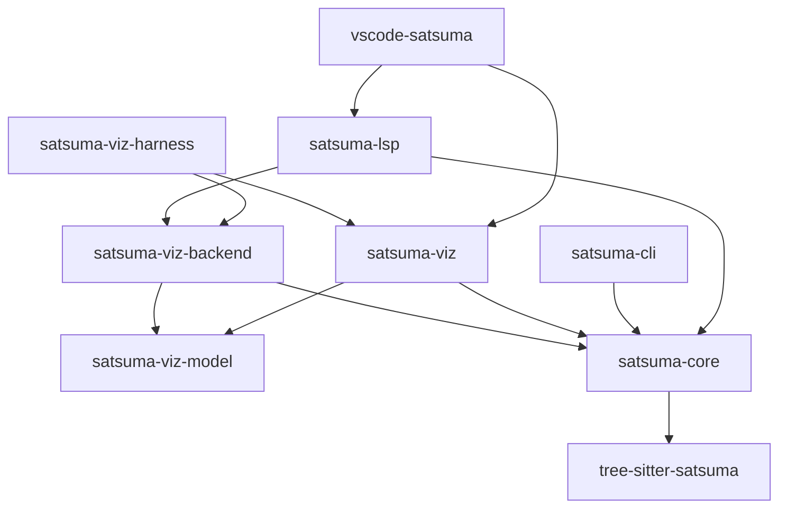
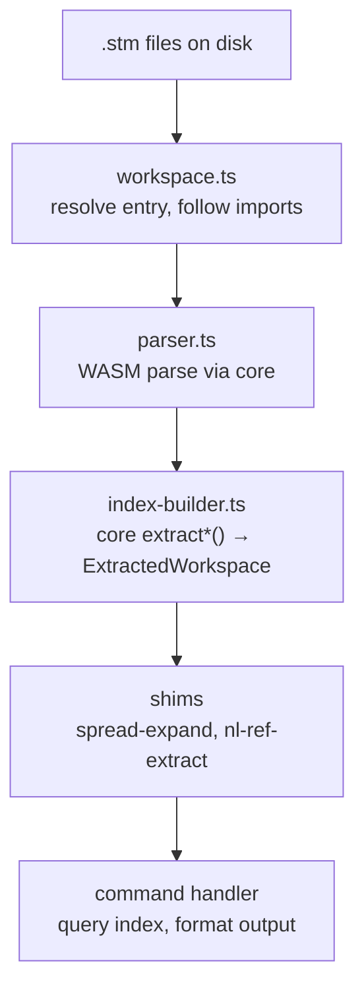
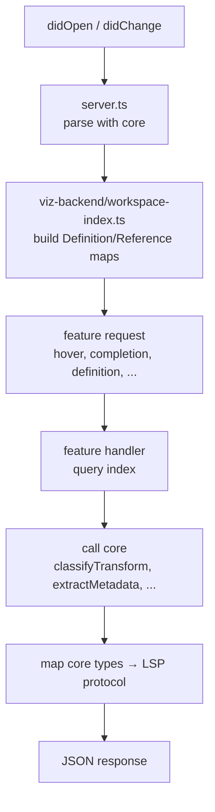
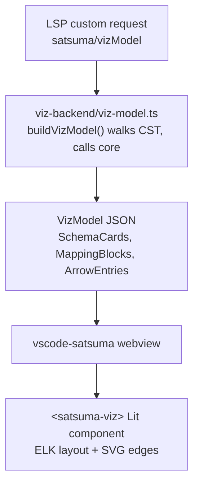

# Satsuma-Lang: A Contributor's Deep-Dive Guide

Last reviewed: 2026-04-07.

## What Is This Codebase?

Satsuma is a domain-specific language (DSL) for describing source-to-target data mappings. Think of it as a replacement for the massive Excel spreadsheets and wiki pages that enterprises use to document how data moves between systems. The language has a parser, a parser-backed CLI command suite, a Language Server Protocol (LSP) implementation, a VS Code extension, and an interactive visualisation component — all in TypeScript, all under `tooling/`.

The language itself sits at an unusual intersection: schemas and field mappings are deterministically parsed, while natural-language annotations ("trim whitespace, apply business rule X") are preserved verbatim for humans or LLMs to interpret. This duality — structural rigour where possible, NL flexibility where needed — is the central design idea.

---

## Architecture at a Glance

The codebase is organised as a strict layer cake of 9 packages. Dependencies flow **downward only** — a rule enforced by convention, not by tooling (there is no build-time cycle checker).

The cardinal rule: **core never imports from CLI, LSP, or viz.** The CLI never imports from the LSP. The LSP never imports from the CLI. This is well-maintained — I found no violations.

### Package Responsibilities

**`tree-sitter-satsuma`** — The grammar definition (`grammar.js`). This is the single source of truth for what constitutes valid Satsuma syntax. It generates a WASM parser that every other package consumes. It also owns corpus test fixtures and tree-sitter highlight queries.

**`satsuma-core`** — The semantic extraction library. All pure, no-I/O logic for turning Concrete Syntax Trees (CSTs) into typed domain objects lives here: schema extraction, field tree building, arrow classification, metadata parsing, spread expansion, NL reference resolution, validation, and formatting. This is the heart of the system. It accepts CST nodes and returns plain data — no filesystem, no LSP types, no CLI types.

**`satsuma-cli`** — The command-line tool. Its commands orchestrate file discovery, import following, workspace index building, and output formatting. It calls core for all extraction and adds file I/O, a lint engine, a diff engine, and human/JSON output formatting on top.

**`satsuma-lsp`** — The Language Server Protocol server. Editor-agnostic (works with VS Code, Neovim, Helix, etc.). Provides hover, completions, go-to-definition, find-references, rename, CodeLens, semantic tokens, diagnostics, and formatting. Delegates all CST extraction to core.

**`satsuma-viz-backend`** — The shared library for building `VizModel` payloads. Contains the workspace index used by both the LSP and the viz test harness. This is the deduplication point that prevents the LSP and harness from depending on each other.

**`satsuma-viz-model`** — Pure TypeScript interfaces defining the `VizModel` JSON contract between server and client. No logic — only types. This is the serialisation boundary between processes.

**`satsuma-viz`** — A Lit web component (`<satsuma-viz>`) that renders a VizModel as an interactive schema-mapping diagram. Uses ELK.js for layout and SVG for edge rendering. It consumes `VizModel` JSON and imports small shared helpers from core, such as coverage and NL reference utilities.

**`vscode-satsuma`** — The VS Code extension: extension activation, webview panel management, command registration, and the TextMate grammar for syntax highlighting.

**`satsuma-viz-harness`** — A standalone HTTP server + browser client for Playwright-driven testing of the viz component without VS Code in the loop.

---

## How Data Flows

Understanding the three main data paths is essential to navigating the code.

### Path 1: CLI — File to Command Output

The CLI's `ExtractedWorkspace` (defined in `types.ts` — renamed from `WorkspaceIndex` in sl-erxz to make its role as an extraction *result* explicit and avoid the name clash with viz-backend's editor index) is a flat collection of `Map<string, Record>` objects — schemas, metrics, mappings, fragments, transforms, plus arrays for notes, warnings, arrows, and NL ref data. It is rebuilt from scratch on every invocation (files are small; full re-parse takes <100ms).

### Path 2: LSP — Document Change to IDE Feature

The LSP's `WorkspaceIndex` (defined in viz-backend) is a different shape entirely: it stores `DefinitionEntry` and `ReferenceEntry` objects with LSP `Range` positions, keyed by symbol name, and is updated incrementally per-file. It kept the `WorkspaceIndex` name in sl-erxz because it is the naturally editor-shaped index; the CLI's batch result type was the one that got renamed (to `ExtractedWorkspace`).

### Path 3: Viz — Server to Rendering

---

## The Most Important Functions and Interfaces

### In `satsuma-core`

| Function / Type | File | What It Does |
|---|---|---|
| `extractSchemas(rootNode)` | `extract.ts` | Returns all `ExtractedSchema` objects from a CST root — name, namespace, note, fields, spreads, position |
| `extractArrowRecords(rootNode)` | `extract.ts` | Returns all `ExtractedArrow` objects — source paths, target path, pipe steps, classification, metadata |
| `extractFieldTree(bodyNode)` | `extract.ts` | Recursively builds a `FieldDecl[]` tree from a `schema_body` node, handling records, lists, and spreads |
| `extractMetadata(node)` | `meta-extract.ts` | Parses `metadata_block` nodes into typed `MetaEntry` discriminated unions (tag, kv, enum, note, slice) |
| `classifyTransform(steps)` | `classify.ts` | Returns `"nl"` if the pipe chain has steps, `"none"` if empty. Trivially simple after Feature 28 removed structural transforms |
| `expandEntityFields(entity, ns, resolver, lookup)` | `spread-expand.ts` | Expands fragment `...spread` references into concrete fields, using callbacks to resolve cross-file fragments |
| `resolveRef(ref, context, lookup)` | `nl-ref.ts` | Resolves a single `@ref` token from an NL transform string against the workspace, returning resolution status and target |
| `validateSemanticWorkspace(index, opts)` | `validate.ts` | Runs shared semantic checks (duplicates, unresolved spreads, bad arrow paths, NL ref validation, import scoping, etc.) against a `SemanticIndex` |
| `format(tree, source)` | `format.ts` | Canonical code formatter — re-emits a parsed tree with consistent indentation and spacing |
| `canonicalRef(ns, schema, field?)` | `canonical-ref.ts` | Builds the canonical `ns::schema.field` reference string used everywhere |
| `SyntaxNode` | `types.ts` | The tree-sitter node interface — the universal input type for all core functions |
| `FieldDecl` | `types.ts` | The extracted field shape — name, type, children, isList, metadata, spreads, position |

### In `satsuma-cli`

| Function / Type | File | What It Does |
|---|---|---|
| `loadWorkspace(pathArg)` | `load-workspace.ts` | The one-call workspace loader used by most CLI commands — resolves the path argument, parses the files, builds the index, and reports any resolve failure with a single consistent `Error resolving path '<arg>': ...` message. Returns `{ files, index }`. |
| `buildIndex(parsedFiles)` | `index-builder.ts` | The big assembler — takes parsed files, calls every core extractor, builds the full `ExtractedWorkspace` with deduplication and cross-reference graph. Usually invoked indirectly via `loadWorkspace`. |
| `ExtractedWorkspace` | `types.ts` | The CLI's workspace model — maps of schemas, metrics, mappings, fragments, transforms, plus arrows, notes, warnings, NL ref data, duplicates |
| `resolveInput(pathArg)` | `workspace.ts` | Lower-level primitive — takes a `.stm` path, follows imports transitively, returns all reachable file paths. Called directly only by `fmt` / `diff` / `validate` (which have custom error handling) and by `loadWorkspace` itself. |
| `buildFullGraph(index)` | `schema-graph.ts` | Constructs a schema-level directed graph (nodes + edges) from the workspace index, including NL-derived edges |
| `diffIndex(indexA, indexB)` | `diff-engine.ts` | Structural comparison of two workspace snapshots — field additions/removals, type changes, arrow changes |
| `RULES` | `lint-engine.ts` | The lint rule registry — currently 3 rules (hidden-source-in-nl, unresolved-nl-ref, duplicate-definition) |

### In `satsuma-lsp` / `satsuma-viz-backend`

| Function / Type | File | What It Does |
|---|---|---|
| `createWorkspaceIndex()` / `indexFile()` | `viz-backend/workspace-index.ts` | Creates and incrementally updates the definition/reference index used for IDE features |
| `buildVizModel(uri, tree, index)` | `viz-backend/viz-model.ts` | Walks a CST and produces the full `VizModel` payload for the viz component; this remains the largest single builder cluster |
| `mergeVizModels(uri, models)` | `viz-backend/viz-model.ts` | Merges per-file VizModels into a cross-file lineage view |
| `computeDefinition()` | `lsp/definition.ts` | Go-to-definition: finds the definition of a symbol under the cursor |
| `computeCompletions()` | `lsp/completion.ts` | Auto-complete: suggests schema names, field names, and fragment names in context |
| `computeHover()` | `lsp/hover.ts` | Hover tooltips: shows field types, schema shapes, and transform classifications |

### The Callback Pattern (ADR-005 / ADR-006)

Core's cross-file operations need workspace data but must not depend on any specific workspace index type. The solution is **callback interfaces**:

- `EntityRefResolver` — resolves a potentially-unqualified entity reference to its canonical key
- `SpreadEntityLookup` — looks up an entity's fields by key
- `DefinitionLookup` — full lookup interface for NL ref resolution (hasSchema, getSchema, expandSpreads, etc.)
- `SemanticIndex` — provides all entities for validation

Each consumer (CLI, LSP, viz-backend) creates these callbacks from its own index type in 3–5 lines. The CLI does this in `spread-expand.ts` and `nl-ref-extract.ts` — permanent (per ADR-005/006) thin bridge modules that adapt `ExtractedWorkspace` to core's callback APIs.

---

## Key Design Decisions (ADRs Worth Reading)

The `adrs/` directory records the major Architecture Decision Records. The most important for a new contributor:

- **ADR-003 / ADR-020**: Core as the single extraction truth. All CST-to-data logic goes through core. Consumers never do their own extraction.
- **ADR-005**: Callback abstractions for spread expansion. Core defines minimal callback types; consumers wire them from their own indexes.
- **ADR-006**: NL reference resolution boundary. Same callback strategy for `@ref` resolution in NL transforms.
- **ADR-008**: Fragment spread expansion semantics — how `...fragment_name` resolves.
- **ADR-022**: File-based workspace model with transitive imports. The workspace boundary is defined by a single entry file and its import graph, not by directory scanning.
- **ADR-010**: LSP server architecture.
- **ADR-021**: Extraction of `satsuma-lsp` as an editor-agnostic package.

---

## The Test Suite

The test suite is broad and deliberately layered. Avoid duplicating the same invariant across layers: core extraction belongs in core tests, CLI output contracts belong in CLI tests, and LSP protocol behaviour belongs in LSP tests.

**Core tests** (`satsuma-core/test/`, `.js` files): Unit-test extraction, classification, formatting, validation, and NL ref resolution against minimal `.stm` snippets. These are the ground truth — if a behaviour is tested here, consumers should not re-test it.

**CLI tests** (`satsuma-cli/test/`, `.ts` files): Integration tests that exercise the full pipeline from `.stm` source text to command output. Tests cover the command suite, the diff engine, the lint engine, graph builders, namespace handling, recovery behaviour, and text/JSON formatting contracts.

**LSP tests** (`satsuma-lsp/test/`, `.js` files): Tests for each LSP feature (hover, completions, definition, references, rename, CodeLens, semantic tokens, diagnostics, formatting, folding, and custom viz requests) against small `.stm` fixture strings.

**Smoke tests** (`smoke-tests/`): Python/pytest BDD-style tests that invoke the compiled CLI binary and assert on its output. These are the outermost integration layer.

**Grammar corpus** (`tree-sitter-satsuma/test/corpus/`): Tree-sitter's built-in test format — input `.stm` snippets paired with expected CST shapes. The recovery corpus includes deliberately malformed mid-edit states and should grow with parser recovery work.

---

## Current Rough Edges

These are current as of the last review. Resolved items are intentionally not listed here.

### 1. The CLI Still Re-Declares Core-Facing Types

`satsuma-cli/src/types.ts` still declares its own `SyntaxNode`, `Tree`, `Parser`, `FieldDecl`, `PipeStep`, and `Classification` instead of importing or re-exporting the core definitions. The shapes are close enough for TypeScript structural typing, but they are not identical: the CLI's `SyntaxNode` lacks core's optional `childForFieldName?`, and the CLI's `FieldDecl` lacks core's source-position fields.

This is low runtime risk but high cognitive overhead. A new contributor has to learn which `FieldDecl` is the public extraction shape, which one is CLI-local, and why `MetaEntry` comes from core while the enclosing field type is copied.

### 2. `web-tree-sitter.d.ts` Is Still Duplicated

The 213-line `web-tree-sitter.d.ts` file is byte-for-byte identical in `satsuma-cli/src/` and `satsuma-lsp/src/`. This should be a single declaration source, most likely in core or a shared types package.

### 3. Parser Adapters Are Mostly Cleaned Up, But Still Split by Consumer

Core owns the parser singleton and the shared CST helpers now. The remaining split is narrower: the CLI keeps legitimate file-I/O helpers in `satsuma-cli/src/parser.ts`, while the LSP and viz-backend each keep a `parser-utils.ts` adapter for `vscode-languageserver` `Range` conversion and concrete `web-tree-sitter` node typing.

The surprising part is small but real: `nodeRange()` is duplicated between the LSP and viz-backend adapters, and the LSP wraps core CST helper functions purely to cast them back to its concrete `Node` type.

### 4. Graph Assembly and NL-Derived Edges Are Still Split

The CLI no longer has two same-named `graph-builder.ts` files, but it still has two graph builders:

- `satsuma-cli/src/schema-graph.ts` builds the schema-level `FullGraph` used by `lineage` and as input to `graph`.
- `satsuma-cli/src/commands/graph-builder.ts` builds the richer `WorkspaceGraph` used by `satsuma graph`.

They still duplicate NL `@ref` schema-edge promotion logic. Field-level NL-derived edge deduplication also appears in the graph command and in `nl-ref-extract.ts::countNlDerivedEdgesByMapping` for summary counts. The rules are close enough that a future bug fix could easily land in one path but not the others.

### 5. `viz-model.ts` Is Still a Large Builder Module

`satsuma-viz-backend/src/viz-model.ts` is about 1,600 lines. It owns schema cards, mapping blocks, arrow entries, metric cards, fragment cards, notes, comments, metadata, each-blocks, flatten-blocks, source-block info, imported-schema stubs, spread expansion, NL `@ref` resolution, and VizModel assembly.

It also re-exports VizModel protocol types from `@satsuma/viz-model` and imports the same types locally for use inside the builder. That import/re-export ceremony is harmless, but it adds to the sense that this file wants to be a small module tree.

### 6. Full LSP Validation Still Falls Back to the CLI

The LSP now runs core's `validateSemanticWorkspace()` in-process for the checks its `WorkspaceIndex` can support. That is a real improvement. The remaining gap is that the LSP/viz-backend index does not store full arrow records or NL ref extraction data, so on save the LSP still runs `satsuma validate --json` as a child process, parses stdout, caches diagnostics, and deduplicates against in-process semantic diagnostics by `code:line`.

This fallback is also where `validate-diagnostics.ts` still has a hand-rolled `pathToFileUri()` implementation instead of Node's `pathToFileURL()`.

### 7. Validation and Lint Are Parallel Diagnostic Systems

Core validation is the main semantic diagnostic pipeline: `validateSemanticWorkspace()` covers duplicates, unresolved spreads, bad arrow paths, NL ref validation, import scoping, and related checks. The CLI lint engine separately defines a rule registry, fix model, and three lint rules.

Both systems are useful, but their separation is now the surprising part: one has broad semantic coverage, the other has the extensible/fixable rule framework. New diagnostics have to choose a home instead of plugging into one obvious diagnostic model.

### 8. Coverage Is Shared at the Utility Level, Not the Result Level

Core owns shared coverage types and path utilities (`coverage.ts`, `coverage-paths.ts`). The LSP still computes mapping coverage from its `WorkspaceIndex`, while the viz component computes mapped-field sets from `VizModel`. They share path semantics, but there is not one canonical `computeCoverage(...)` result object that both consumers use.

### 9. Monorepo Tooling Is Still Manual

The repo has useful scripts (`install:all`, `scripts/run-repo-checks.sh`, `test:coverage`), but it is still not an npm-workspaces-style monorepo. Each package has its own lockfile and scripts, there is no dependency graph-aware task runner, and there is no plain root `npm test` equivalent to the full repo check.

---

## What It Would Take to Be World-Class

The architecture is in good shape: core owns extraction, consumers are layered cleanly, and the test suite is broad. The remaining step up is less about new features and more about making the package boundaries impossible to misunderstand.

### 1. Make Core the Single Owner of Shared Types

`SyntaxNode`, `Tree`, `FieldDecl`, `PipeStep`, `Classification`, and tree-sitter declaration types should be defined once and imported everywhere. Consumer packages should define only consumer-specific records and protocol types.

### 2. Remove the LSP Validation Subprocess

Either teach the LSP/viz-backend `WorkspaceIndex` to store the arrow and NL-ref data needed by `validateSemanticWorkspace()`, or introduce a shared core workspace index that both CLI and LSP can build. The editor path should not need to exec the CLI and merge JSON diagnostics back into LSP diagnostics.

### 3. Make NL-Derived Edge Logic a Core API

The CLI graph, lineage, and summary paths all care about related variants of the same question: when does an NL `@ref` imply a new lineage edge, and when is it redundant with a declared arrow? That rule should exist once, with tests at the core boundary. The lint rules can keep using the same shared ref classification and resolution helpers without owning edge construction.

### 4. Unify Diagnostics Without Losing Fixes

Core validation has the broad semantic knowledge. CLI lint has the pluggable rule/fix model. World-class would combine those strengths into one diagnostic rule framework with explicit inputs, stable rule IDs, and optional fixes where safe.

### 5. Split VizModel Assembly by Entity Type

Keep `buildVizModel()` as the public API, but move schema-card, mapping-block, metric-card, fragment-card, note/comment, and imported-stub assembly into focused modules. The current tests can follow the module boundaries instead of treating one file as the whole subsystem.

### 6. Add Monorepo and Dependency Enforcement

Move from hand-wired package installs and checks to workspaces plus a task runner or equivalent dependency graph. Add CI-visible dependency rules so "core never imports consumers" is mechanically enforced, not only reviewed.

### 7. Add Generated Grammar Constants and Benchmarks

Generate `NodeTypes` constants from `tree-sitter-satsuma/src/node-types.json` so CST node-type renames fail at compile time. Add small performance benchmarks and property/fuzz tests around parse → extract → format → re-parse so architectural performance claims and grammar edge cases are protected.

---

## Recommended Refactorings (Prioritised)

These are concrete, incremental improvements ordered by impact-to-effort ratio. None requires a rewrite; each can be landed as a single PR.

### Tier 1 — High Impact, Low Risk (do first)

**R1. Replace CLI duplicate core-facing types with core imports.**
Keep CLI-only records in `satsuma-cli/src/types.ts`, but import or re-export shared core types instead of copying them. Start with `SyntaxNode`, `Tree`, `FieldDecl`, `PipeStep`, and `Classification`; make sure the CLI's source-position assumptions still hold after switching to core `FieldDecl`.

**R2. Deduplicate `web-tree-sitter.d.ts`.**
Move the duplicated declaration file to a single shared location and update both CLI and LSP imports. This is a no-behaviour-change cleanup with an easy correctness check: the two current files compare byte-for-byte identical.

**R3. Replace the LSP's hand-rolled file URI conversion.**
In `satsuma-lsp/src/validate-diagnostics.ts`, replace `pathToFileUri()` with `pathToFileURL(fsPath).toString()` from `node:url`. Add a targeted test for paths containing `#`, spaces, and Windows-style input if the test environment can cover it cleanly.

### Tier 2 — Medium Impact, Moderate Effort

**R4. Consolidate graph assembly and NL-derived edge rules.**
Either merge `schema-graph.ts` and `commands/graph-builder.ts`, or extract a shared graph core that both call. Put NL-derived edge promotion and deduplication in one tested helper rather than keeping schema-level and field-level variants scattered across graph and summary code.

**R5. Break up `viz-model.ts`.**
Split the large VizModel builder into focused modules (`schema-card`, `mapping-block`, `metric-card`, `fragment-card`, `notes-comments`, `imported-stubs`) with `buildVizModel()` left as the orchestrator and public API.

**R6. Unify diagnostic rule plumbing.**
Design a shared diagnostic rule contract in core, then migrate semantic validation and the CLI lint rules into it. Preserve lint's fix capability as optional rule metadata rather than keeping a separate diagnostic system forever.

**R7. Move full validation data into the LSP index.**
Index arrow records and NL ref data in the LSP/viz-backend workspace index so `validateSemanticWorkspace()` can run the full set of checks in-process. This unlocks removal of the CLI subprocess fallback and the diagnostic deduplication layer in `server.ts`.

### Tier 3 — High Impact, High Effort (plan carefully)

**R8. Design a shared core workspace index.**
If the CLI and LSP keep needing the same semantic data in different shapes, introduce a core index abstraction that supports both batch construction and incremental updates. This is larger than R7, but it would remove the deepest reason validation, graph, and callback adaptation keep diverging.

**R9. Move to real monorepo tooling.**
Adopt npm workspaces or an equivalent task graph, collapse redundant install/lockfile mechanics where possible, and add an obvious full-repo `npm test` or `npm run check`. Keep `scripts/run-repo-checks.sh` if it remains useful, but make the package graph explicit.

**R10. Generate CST node-type constants.**
Generate a typed `NodeTypes` module from `tree-sitter-satsuma/src/node-types.json` and migrate string literals like `"schema_block"`, `"field_decl"`, and `"source_ref"` to it. This is mechanically large but pays off whenever the grammar changes.

**R11. Add grammar fuzzing and performance baselines.**
Keep the hand-crafted corpus, but add property/fuzz tests for parser recovery and round-tripping. Add a small benchmark suite for parse, extract, validate, format, and workspace-index operations so performance assumptions become measured contracts.

---

## What I'd Do Differently from Scratch

If I were designing this system with today's knowledge and a blank slate, here's what would change. These are not criticisms of the existing design — many of these choices were made for good reasons at the time (speed of iteration, evolving requirements, solo-developer pragmatism). But hindsight is free.

### 1. One workspace index, not two

The biggest structural tension in the codebase is that the CLI and the LSP each have their own workspace data structure with different shapes, different update semantics, and different data. The CLI's `ExtractedWorkspace` is a flat `Map<string, Record>` structure rebuilt from scratch on every invocation. The viz-backend's `WorkspaceIndex` is an incremental `Map<string, DefinitionEntry[]>` that tracks LSP `Range` positions.

From scratch, I'd define **one** workspace index type in core with a clear interface: `addFile(uri, tree)`, `removeFile(uri)`, `getSchema(name)`, `getArrows(mappingName)`, `iterateAll()`. The index would store core extraction results (the `Extracted*` types) enriched with source positions. The CLI would build it in batch mode (add all files, query, discard). The LSP would build it incrementally (add/update on change, query on request). The index type would live in core and would not contain any LSP-specific types like `Range` — consumers would convert positions at the boundary.

This one change would eliminate: the two parallel workspace types, the CLI ↔ core callback bridges, the missing-arrow-records gap that forces the LSP to subprocess, and the divergent duplicate-detection logic.

### 2. The grammar would own the node-type string constants

Currently, CST node type strings like `"schema_block"`, `"mapping_block"`, `"field_decl"`, `"pipe_step"`, `"source_ref"` appear as string literals scattered across every package. A typo in any of them is a silent bug. I'd generate a `NodeTypes` enum or const object from `tree-sitter-satsuma/src/node-types.json` at build time and use it everywhere. A grammar change that renames a node type would then produce compile errors instead of silent breakage.

### 3. Commands as pure functions, not Commander registrations

The CLI is much better than it used to be: command actions go through `runCommand()`, and most commands use `loadWorkspace()`. From scratch, though, I'd separate the last remaining concerns completely:

- **Command functions** are pure: `(index: ExtractedWorkspace, options: SchemaOpts) → SchemaResult`. No I/O, no side effects. Trivially testable.
- **Formatters** convert results to human text or JSON: `(result: SchemaResult, format: "text" | "json") → string`.
- **CLI wiring** handles Commander registration, file resolution, index building, and output writing. One thin orchestrator per command, or even a single generic one.

This would make command behaviour easier to test directly and would make CLI logic easier to reuse from the LSP without shelling out.

### 4. A monorepo tool from the start

The current setup is a manual monorepo: 9 packages with independent lockfiles and package scripts, plus a root `install:all` script and a repo-check shell script. There's no build caching, no dependency graph-aware task runner, and no way to run "tests affected by this change."

From scratch I'd use `npm workspaces` (or Turborepo/Nx) from the beginning. Benefits: single `npm install`, automatic workspace symlinks, parallel builds with caching, `turbo run test --filter=...[HEAD~1]` for affected-only CI, and a single lockfile. The layered dependency graph is already clean enough to benefit immediately.

### 5. The VizModel contract would use JSON Schema, not TypeScript interfaces

`satsuma-viz-model` defines the serialisation boundary between the server (LSP/harness) and the client (web component) as TypeScript interfaces. But this contract crosses a process boundary — the server serialises JSON, the client parses it. TypeScript interfaces provide no runtime validation.

I'd define the VizModel as a JSON Schema (or Zod schema, or similar) with generated TypeScript types. This gives: runtime validation at the boundary (catch contract violations before they become rendering bugs), auto-generated documentation, and the ability to version the schema independently of the TypeScript code.

### 6. Coverage logic in one place

Field coverage logic is now partly shared through core path utilities, but higher-level result construction still lives separately in the LSP and viz component. Each consumer still answers its own version of "which fields are covered by arrows?"

I'd put all coverage computation in core behind a single function: `computeCoverage(schema, arrows, fragments) → CoverageResult`. The result would include per-field coverage status, coverage percentage, and uncovered field paths. The viz component and LSP would consume this result object instead of each re-deriving coverage from raw data.

### 7. NL `@ref` handling would not be hybrid

The grammar now has a structural `at_ref` node for bare pipe text and metadata value text. Quoted `nl_string` and `multiline_string` content remains opaque to the grammar, so core still uses the canonical `createAtRefRegex()` path to find refs inside those strings.

From scratch, I'd avoid the hybrid. Either `@ref` is structural everywhere, including inside quoted and multiline NL strings, or quoted strings are explicitly opaque and never produce lineage refs. The current compromise is practical, but it means both grammar corpus tests and regex tests are needed to understand the full rule.

### 8. Tests would use a snapshot pattern for structured outputs

The CLI test suite still contains many assertions of the form `assert.equal(data.schemas[0].name, "foo")` / `assert.equal(data.schemas[0].fields.length, 3)` — testing one field at a time. Snapshot-style assertions (`assert.deepStrictEqual(data, expectedSnapshot)`) can reduce maintenance while increasing coverage (a snapshot catches unexpected extra fields; individual asserts don't). Jest snapshots or inline snapshot objects both work. The tradeoff is readability of failure messages, but for structured data extraction, snapshots are often the right call.

### 9. Incremental parsing from the start

The current implementation gets away with full re-parsing because Satsuma files are small. But that decision becomes harder to reverse as adoption grows. Tree-sitter natively supports incremental parsing (you pass the old tree + the edit range, and it only re-parses the changed region). I'd wire this up from the beginning in the LSP, not because it's needed now, but because it's essentially free (tree-sitter does the work) and it future-proofs the architecture for larger files.

---

## Summary: What a New Contributor Should Know

1. **Start in `satsuma-core`**. Read `types.ts`, then `extract.ts`, then `cst-utils.ts`. These files define the CST and extraction vocabulary used everywhere else.

2. **The grammar and spec are the authorities.** Use `docs/developer/SATSUMA-V2-SPEC.md`, `tooling/tree-sitter-satsuma/grammar.js`, and the corpus fixtures when syntax or CST shape is unclear.

3. **All extraction logic should go through core.** If CLI, LSP, or viz code needs to walk CST nodes for domain extraction, first ask whether that logic belongs in core instead.

4. **The CLI and LSP workspace models are intentionally different today.** The CLI's `ExtractedWorkspace` is a batch extraction result. The viz-backend `WorkspaceIndex` is an incremental editor index with ranges. The naming collision is gone, but the data gap still matters: the LSP index does not yet hold everything needed for full in-process validation.

5. **The CLI bridge files are intentional.** `satsuma-cli/src/spread-expand.ts` and `satsuma-cli/src/nl-ref-extract.ts` adapt `ExtractedWorkspace` to core callback APIs. Do not treat them as dead shims.

6. **The main rough edges are duplicated types, graph/NL-edge duplication, the LSP validation subprocess, and the large VizModel builder.** Older rough edges around mass `process.exit()` calls and the `WorkspaceIndex` name collision have been addressed.

7. **Read the ADRs before changing boundaries.** ADR-005, ADR-006, ADR-020, ADR-021, and ADR-022 explain why core callbacks, editor-agnostic LSP packaging, and file-based workspaces look the way they do.

8. **Test at the right level.** Core extraction belongs in core tests. CLI formatting and JSON contracts belong in CLI tests. LSP protocol behaviour belongs in LSP tests. Do not duplicate the same invariant across layers unless the consumer integration is the thing under test.
